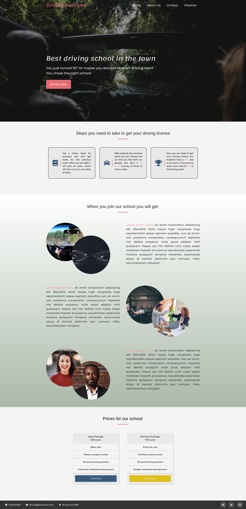
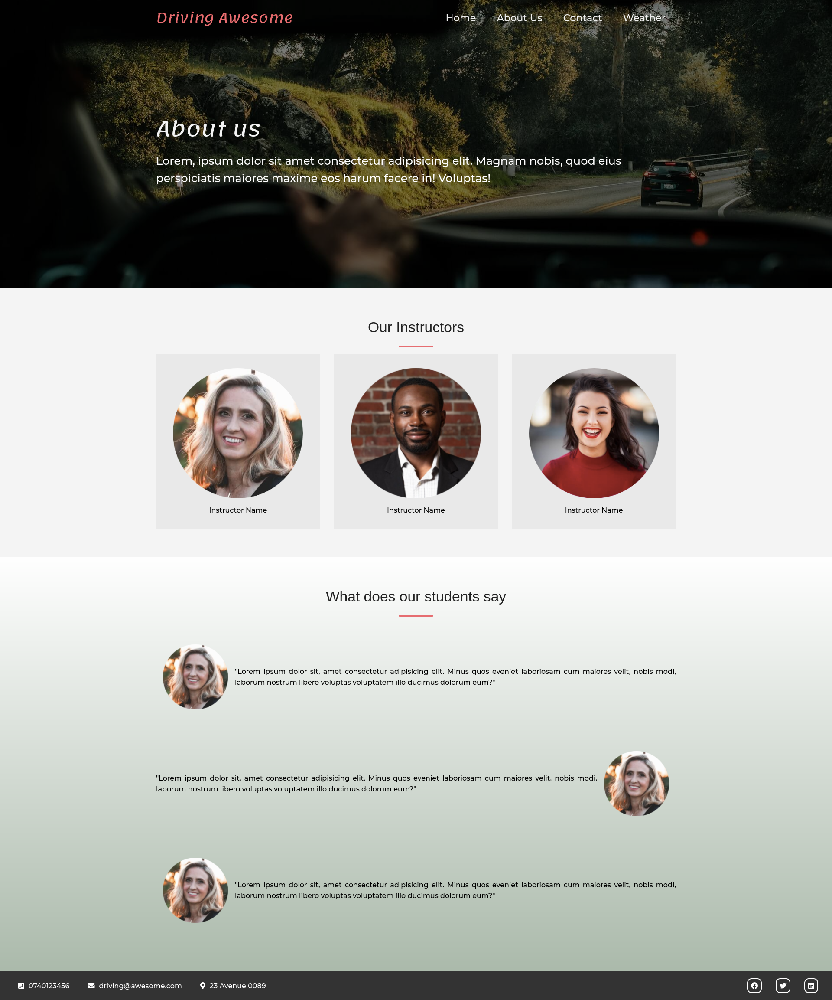
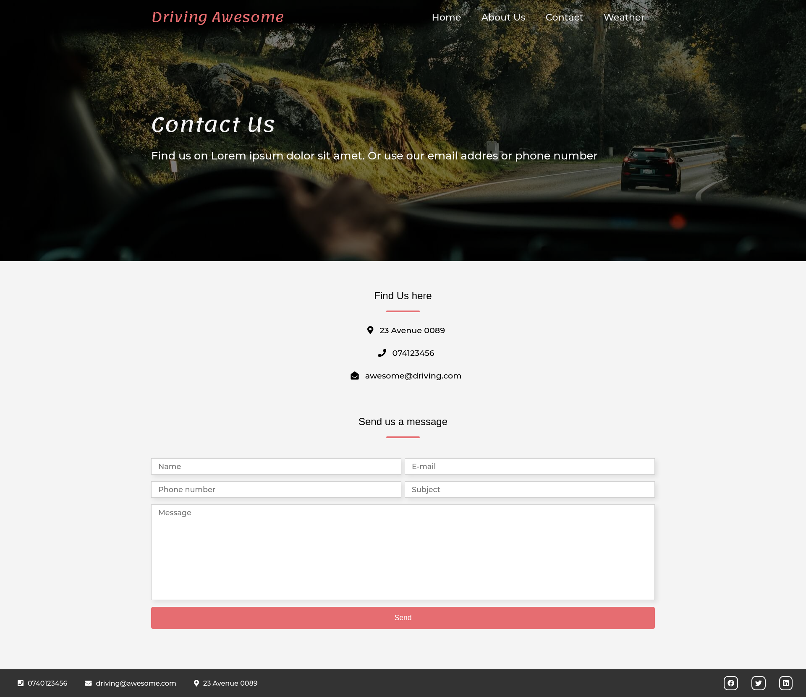
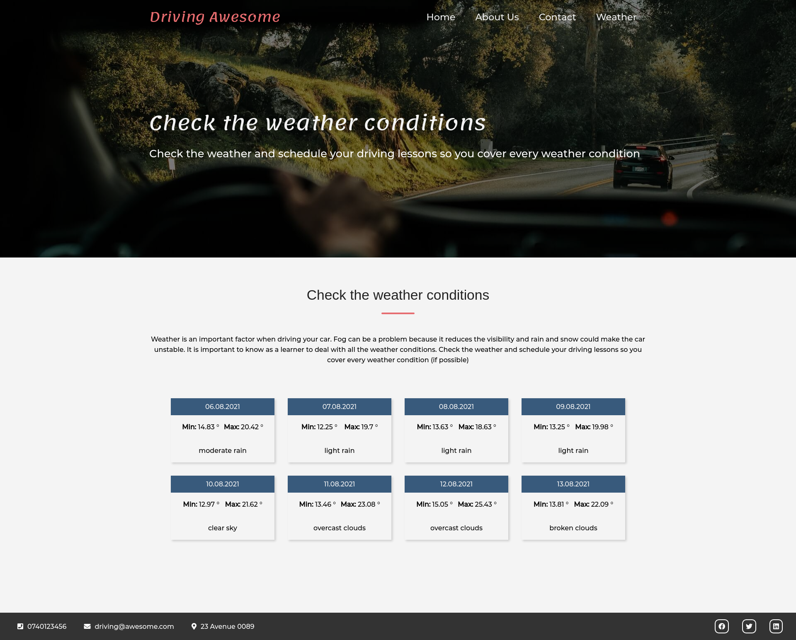

# Driving-School

Presentation website for a fictional driving school company

### How did it start

It started as a simple, brochure website for a drivning school using only html and css. But since i had many ideas that could not fit only in one page,
i decided to create 3 more pages and include javaScript for animations and an exteranl api

### Technologies used
HTML5, CSS3, javaScript (ES6)

### External sources
* <a href="https://fonts.google.com/" > Google Fonts </a>
* <a href="https://fontawesome.com/" > Font Awesome </a>

# Website presentation

<h3>1.First page </h3>
 
<h3>1Second page - About </h3>
 
<h3>1.Third page - Contact </h3>
 
<h3>1.Fourth page - Weather </h3>
 
Weather is brought from an external api that can be found <a href="https://api.openweathermap.org " > Here </a> 
